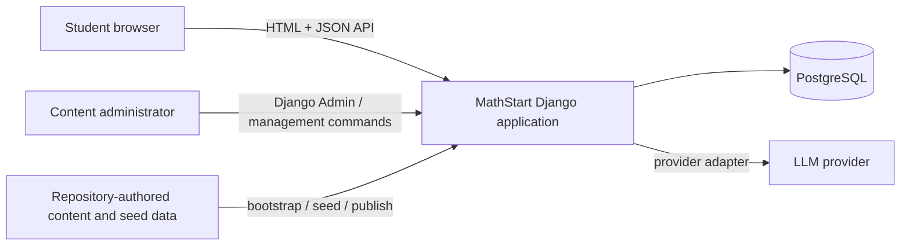
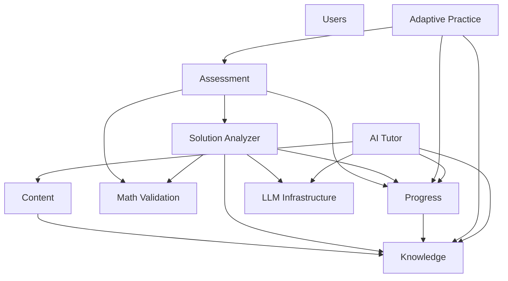
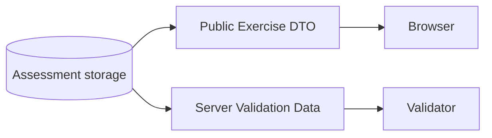
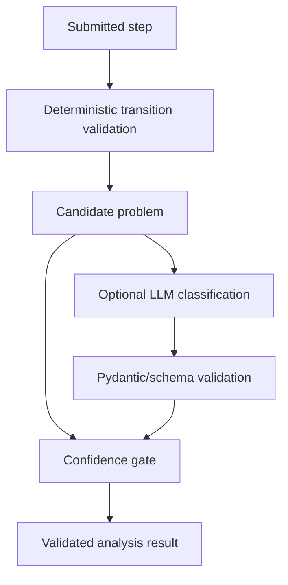
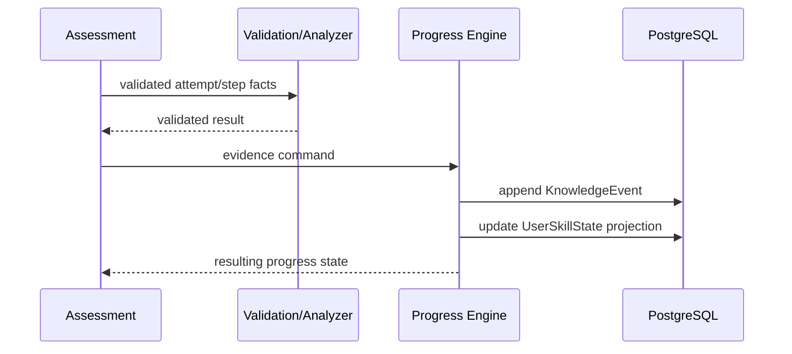
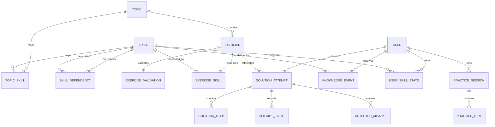
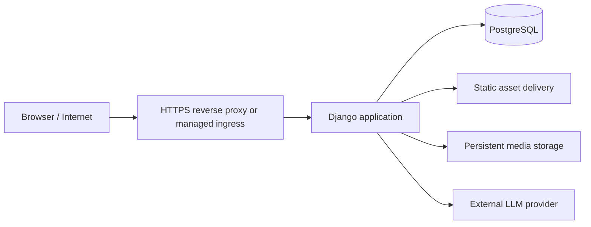

# MathStart Architecture

## 1. Purpose

This document defines the target architecture of MathStart v3.1 and the rules that preserve its domain boundaries while the existing Django project evolves into the intelligent educational system described in `PRODUCT.md`.

This is the architecture-level source of truth.

Use:

- `AGENTS.md` for coding-agent operating rules;
- `PRODUCT.md` for product scope and user behavior;
- `ARCHITECTURE.md` for system structure, data ownership, dependencies, and invariants;
- `docs/adr/` for significant accepted decisions and their rationale;
- `specs/` for detailed subsystem contracts;
- `docs/exec-plans/` for implementation plans.

The existing `docs/architecture.md` remains useful documentation of the current content publication/bootstrap subsystem. It must not be deleted merely because this root architecture document exists.

---

## 2. Architectural baseline

MathStart is a **Django modular monolith**.

The project evolves incrementally from the existing Django application rather than being rewritten around a new backend framework.

Baseline direction:

- Python 3.12+
- Django 5.2+
- Django ORM
- Django migrations
- PostgreSQL as the target primary database
- Django Templates for server-rendered pages
- progressive JavaScript for interactive learning UX
- Django REST Framework for JSON API endpoints where needed
- SymPy + deterministic/domain validators for supported mathematics
- Pydantic for structured LLM outputs and selected typed contracts
- provider abstraction for LLM integrations
- Docker-based reproducible production path
- GitHub Actions for CI

The current repository still uses SQLite as its local runtime database.
SQLite is a transition-state implementation detail, not the target production database.

Do not replace Django, Django ORM, or Django migrations without an accepted ADR.

---

## 3. Current repository baseline

The current project already contains a stable content platform.

`requirements.txt` and `config/settings.py` describe the installed runtime.
DRF, SymPy, Pydantic, PostgreSQL, the intelligent-learning apps, Docker, and
GitHub Actions are target capabilities, not configured R01 tooling.
Local setup is documented in `README.md`; current checks are documented in
`skills/verification/SKILL.md` and run by `scripts/verify_repo.py`.

Existing authored self-check lessons embed solutions in HTML (for example,
`templates/lessons/components/exercise.html` uses `<details>`). They do not yet
implement the new Assessment attempt, server-reveal, or knowledge-event
contracts. Preserve this existing content during R01, as required by
the scope rules in `AGENTS.md`. Sections 13-14 and 24 define the target contracts for
the intelligent exercise system; they are not claims that legacy lessons
already enforce answer secrecy or record reveals. Converting lessons requires
a later scoped specification.

Important existing components:

```text
config/
    Django settings, URL configuration, WSGI/ASGI entry points

content/
    existing content models
    page views
    publishing services
    site bootstrap
    quality/integrity checks
    management commands
    content tests

curriculum/
    version-controlled source of truth for 263 lesson topics

site_content/
    version-controlled source of truth for:
    - catalogue structure
    - structural/informational pages
    - redirects
    - seed media metadata/files

templates/
    Django templates

static/mathstart/
    shared CSS/JavaScript

docs/
    existing technical documentation

var/
    local reports/backups; not source of truth
```

The existing `content` domain currently includes these models:

- `Grade`
- `Subject`
- `Section`
- `ContentPage`
- `LessonPublication`
- `MediaAsset`
- `Redirect`

The current content runtime is reproducible from migrations plus repository-managed sources:

```text
python manage.py migrate
python manage.py bootstrap_site
```

This capability is valuable and must be preserved.

---

## 4. Core architectural principle

MathStart contains two fundamentally different classes of data.

### 4.1. Repository-authored/reproducible data

Examples:

- curriculum lessons;
- site structure;
- static informational pages;
- redirects;
- seed media;
- pilot skill taxonomy;
- pilot prerequisite graph;
- curated pilot exercises;
- mistake taxonomy;
- validation specifications where suitable for repository-managed seeding.

These should be reproducible from version-controlled sources where practical.

### 4.2. Runtime/historical user data

Examples:

- users;
- student profiles;
- diagnostic sessions;
- solution attempts;
- solution steps;
- hint/reveal events;
- detected mistakes;
- knowledge events;
- user skill state;
- adaptive practice sessions;
- AI conversations;
- AI run metadata.

These are authoritative runtime records and **must never be overwritten by content bootstrap**.

This distinction is a critical architecture boundary.

`bootstrap_site` may rebuild repository-authored site content.
It must not become a global database reset that mutates or destroys user evidence.

---

## 5. Target system context



MathStart remains one deployable application for MVP.

There is one primary relational database.

No microservice split is required.

---

## 6. Logical domain architecture

The modular monolith is divided into explicit logical domains.



Arrows represent allowed use/dependency direction at the application/service level.

They do not mean every domain may directly import every model from the destination.

Cross-domain operations should prefer explicit service interfaces.

---

## 7. Target package/app structure

The architecture is expected to evolve toward a structure similar to:

```text
MathStart-Python/
├── config/
│
├── content/                  # existing site/content domain
├── users/                    # student profile/onboarding domain
├── knowledge/                # skills + prerequisite graph
├── assessment/               # exercises, attempts, steps, diagnostics
├── progress/                 # knowledge events + projections
├── solution_analyzer/        # analysis orchestration
├── math_validation/          # deterministic math validation
├── ai_tutor/                 # tutor conversations/context/policy
├── adaptive_practice/        # targeted remediation sessions
├── llm/                      # provider adapters + AI run infrastructure
│
├── curriculum/               # existing lesson sources
├── site_content/             # existing site sources
├── seed_data/                # future repo-managed intelligent-domain seeds
│   ├── knowledge/
│   └── assessment/
│
├── templates/
├── static/
├── specs/
├── docs/
├── skills/
│
├── AGENTS.md
├── PRODUCT.md
└── ARCHITECTURE.md
```

This is a target modular structure, not an instruction to create all applications immediately.

New packages/apps should be introduced only when their implementation work begins.

Do not create empty architecture theatre merely to match the diagram.

---

## 8. Django app boundaries

Logical domains and Django apps should align where persistent ownership or independent application behavior justifies the boundary.

The intended ownership is:

| Domain | Primary responsibility |
| --- | --- |
| `content` | grades, subjects, sections, pages/topics, topic-to-skill mappings, lesson publication, redirects, media |
| `users` | student profile, selected grade, onboarding mode |
| `knowledge` | skills and prerequisite graph |
| `assessment` | exercises, validation records, attempts, steps, diagnostics, mistakes |
| `math_validation` | parser, normalizer, deterministic/domain validation |
| `solution_analyzer` | analysis orchestration and confidence gating |
| `progress` | knowledge events and `UserSkillState` projection |
| `adaptive_practice` | practice sessions and item selection |
| `ai_tutor` | tutor context, conversation, tutor policy |
| `llm` | provider abstraction, provider adapters, retries/timeouts, AI run metadata |

Domain ownership matters more than Django convenience.

A model must not be placed in an unrelated app merely because that app already exists.

---

## 9. Existing Content domain

The existing `content` app remains the owner of the current educational site/content runtime.

### 9.1. Existing source model

The current file-to-runtime flow remains valid:

```text
curriculum/ + site_content/
            |
            v
publishing / bootstrap services
            |
            v
ContentPage + related content models
            |
            v
Django views/templates
            |
            v
browser
```

### 9.2. Topic identity

The existing runtime represents an educational topic through `ContentPage` where:

```text
page_type == TOPIC
```

The final intelligent-layer topic persistence and reference contract will be
fixed by the relevant R02/V02 spec/ADR after inspecting `content/models.py`
and the existing `ContentPage` relationships. Avoid duplicate sources of truth.
R01 neither selects a separate `Topic` model nor permanently forbids one.
Any resulting schema transition must include its migration plan.

### 9.3. File-managed content

The following existing behavior remains protected:

- `curriculum/` is the source of truth for lessons;
- `site_content/` is the source of truth for site structure and seed site data;
- file-managed content is read-only in Django Admin;
- publishing remains conflict-aware;
- bootstrap remains idempotent;
- content quality/integrity checks remain part of verification.

### 9.4. Topic-to-skill mappings

Content owns topic-to-skill mappings (`TopicSkill`) in the v3.1 baseline.
Content depends on Knowledge to reference stable skills; Knowledge does not
depend on Content for these mappings.

A mapping may include importance, role, and ordering metadata. Its topic
reference follows the R02/V02 contract described in section 9.2; R01 does not
fix a foreign key to either `ContentPage` or a new `Topic` model.

---

## 10. Users domain

The MVP uses Django's authentication infrastructure.

Because the existing project already uses Django and has not yet introduced a custom user model, the baseline approach is:

```text
django.contrib.auth user
        +
StudentProfile
```

`StudentProfile` owns MathStart-specific user information such as:

- selected grade;
- onboarding mode;
- display/profile fields needed by the product;
- product-specific timestamps/state.

Do not introduce a custom `AUTH_USER_MODEL` after dependent migrations begin without an accepted ADR and migration strategy.

### Authentication for MVP

For the same-origin web application:

- Django session authentication is the default;
- CSRF protection remains enabled;
- passwords are handled by Django password hashing;
- secrets never live in browser code.

Token/JWT authentication is not required for the MVP unless a separate client appears.

---

## 11. Knowledge domain

The Knowledge domain owns the objective subject model.

Expected core models:

```text
Skill
SkillDependency
```

### `Skill`

Represents an atomic learnable capability.

Important properties:

- stable `code`;
- human-readable name;
- description;
- grade applicability;
- active/archive state.

Skill `code` is an external/domain identifier and must be treated as stable.

### `SkillDependency`

Represents:

```text
prerequisite_skill -> dependent_skill
```

Rules:

- no self-edge;
- no cycles;
- relation type is controlled;
- strength is bounded;
- graph validation is automated.

Topic-to-skill mappings belong to Content (section 9.4), not Knowledge.

The knowledge graph is **not user progress**.

---

## 12. Assessment domain

Assessment owns exercise definitions and immutable/append-oriented facts about student work.

Expected core entities:

```text
Exercise
ExerciseValidation
ExerciseSkill
DiagnosticSession
SolutionAttempt
SolutionStep
AttemptEvent
MistakeType
MistakeSkillMapping
DetectedMistake
```

### 12.1. `Exercise`

Public exercise definition and interaction contract.

Expected fields/concepts include:

- topic;
- stable code;
- statement;
- interaction mode;
- input schema;
- step schema;
- parser profile;
- difficulty;
- reveal policy;
- version;
- active/archive state.

### 12.2. `ExerciseValidation`

Server-only validation data.

Expected concepts include:

- answer key;
- validation specification;
- canonical solution;
- accepted variants;
- version.

This model must not be serialized by the ordinary public exercise endpoint.

### 12.3. `ExerciseSkill`

Maps an exercise to the skills it actually evaluates.

### 12.4. `SolutionAttempt`

Represents one student's work on one exercise.

It owns attempt-level facts such as:

- user;
- exercise;
- exercise version/snapshot identifier;
- source;
- status;
- started/submitted timestamps;
- final answer payload;
- hint usage;
- answer reveal timestamp.

### 12.5. `SolutionStep`

A typed ordered step.

Expected concepts:

- attempt;
- step number;
- step type;
- structured payload;
- raw text;
- normalized representation;
- parse status;
- timestamp.

Constraint:

```text
UNIQUE(attempt, step_no)
```

### 12.6. `AttemptEvent`

Append-oriented UX facts such as:

- hint requested;
- answer revealed;
- retry;
- other events needed for audit/evidence semantics.

### 12.7. Mistake taxonomy

Persistent mistake classification uses controlled codes.

The LLM must not create arbitrary persistent mistake codes.

`DetectedMistake` represents a validated analysis result tied to an attempt/step and skill with confidence.

---

## 13. Interaction-mode boundary

Every exercise has one explicit interaction mode:

```text
SELF_CHECK
FINAL_ANSWER
STEP_BY_STEP
STRUCTURED_SOLUTION
```

The interaction mode controls:

- browser UX;
- accepted payload shape;
- validation path;
- evidence semantics.

A new interaction mode requires a spec and tests.

Frontend behavior must not silently define new domain modes.

---

## 14. Public exercise vs validation secret

The system deliberately separates the public interaction contract from the correct answer/validator internals.



Ordinary public exercise responses may contain:

- ID/code;
- statement;
- interaction mode;
- difficulty;
- public input schema;
- public step schema;
- reveal policy;
- public skill metadata when needed.

They must not contain:

- answer key;
- canonical solution;
- private validation specification;
- secret accepted variants.

Reveal is a server action, not a hidden field already present in the page.

---

## 15. Math Validation domain

`math_validation` should contain as much deterministic logic as is reliable for the supported MVP mathematics.

Pipeline:

```text
raw input
    |
    v
normalizer
    |
    v
parser
    |
    v
normalized mathematical representation
    |
    v
answer / transition / domain validator
    |
    v
deterministic validation result
```

Responsibilities include:

- syntax normalization;
- decimal separator normalization;
- multiplication normalization;
- simple fraction handling;
- unary minus handling;
- supported expression parsing;
- expression/equation equivalence checks;
- transition validation for supported transformations.

SymPy may be used behind stable domain interfaces.

### Parse outcomes

The parser must support explicit outcomes such as:

```text
OK
UNSUPPORTED
INVALID
NOT_REQUIRED
```

Unsupported input is not automatically a misconception.

Raw input is always preserved separately from normalized representation.

---

## 16. Solution Analyzer

Solution Analyzer orchestrates error analysis.

It is not the mathematical source of truth and does not own progress state.

For a supported step-by-step flow:



The LLM is optional in the pipeline.

If deterministic rules can classify the case reliably, no LLM call is required.

If LLM output is malformed, unsupported, or below confidence threshold, the analyzer must return a safe non-strong result.

Solution Analyzer may create/return an analysis result suitable for persistence as a `DetectedMistake`, but it must not directly update `UserSkillState`.

---

## 17. Progress domain

Progress is the **only owner of long-term student knowledge state**.

Expected core entities:

```text
KnowledgeEvent
UserSkillState
```

### 17.1. `KnowledgeEvent`

Append-oriented evidence record.

Expected concepts include:

- user;
- skill;
- event type;
- strength;
- source type/source ID;
- difficulty;
- first-try flag;
- hint-used flag;
- reveal-used flag;
- confidence;
- metadata;
- occurrence time;
- algorithm/spec version when needed for reproducibility.

Every automatic progress change must be explainable through one or more knowledge events.

### 17.2. `UserSkillState`

Current projection for one user and one skill.

Expected concepts:

- mastery;
- confidence;
- evidence count;
- status;
- last evaluation time.

Constraint:

```text
UNIQUE(user, skill)
```

### 17.3. Projection rule

The event log is evidence/history.
`UserSkillState` is a derived current projection.

The system should be designed so the projection can be recomputed when the algorithm evolves.

Do not let controllers, templates, AI Tutor, or LLM provider adapters directly mutate mastery/confidence.

---

## 18. Progress update flow



For one user action, persistence that must stay consistent should be wrapped in an appropriate Django transaction.

Progress event creation must be idempotent against request retries/double submission.

The exact idempotency constraints belong in the progress/assessment specs and migrations.

---

## 19. Adaptive Practice domain

Adaptive Practice reads from:

- Progress;
- Knowledge;
- Assessment exercise catalogue.

It owns:

```text
PracticeSession
PracticeItem
```

Expected `PracticeSession` concepts:

- user;
- origin topic;
- target skill;
- return topic;
- status;
- timestamps.

Adaptive Practice selects exercises.
It does not fabricate mastery.

Practice results still flow through normal Assessment -> Progress evidence paths.

---

## 20. AI Tutor domain

AI Tutor owns educational assistance, not knowledge state.

Expected responsibilities:

- context building;
- conversation lifecycle;
- tutor policy;
- hint-first behavior;
- message persistence.

Expected core entities:

```text
AIConversation
AIMessage
```

Tutor context may use read-only projections from:

- current topic/content;
- relevant skills;
- prerequisite graph;
- `UserSkillState`;
- recent confirmed mistakes;
- current exercise/attempt.

AI Tutor must not directly update progress.

A tutor message may influence later evidence only through explicit user actions such as hint usage and validated attempts.

---

## 21. LLM Infrastructure

Provider-specific LLM code belongs behind a stable provider interface.

Target shape:

```text
Domain service
    |
    v
LLMProvider interface
    |
    +--> OpenAI adapter
    +--> fake/test provider
    +--> future provider adapter
```

Responsibilities:

- provider/model selection;
- request execution;
- timeouts;
- bounded retries;
- structured-output handling;
- error normalization;
- usage/latency metadata;
- AI run logging.

Expected infrastructure entity:

```text
AIRun
```

Possible fields/concepts:

- purpose;
- provider;
- model;
- prompt version;
- status;
- latency;
- input/output token usage;
- validated output metadata;
- error code;
- timestamp.

Provider-specific SDK imports must not leak into domain modules.

Automated tests must not require a real LLM provider.

---

## 22. Structured LLM output

LLM output that affects domain decisions must use controlled schemas.

Pydantic is the baseline validation mechanism for LLM structured output.

Example conceptual flow:

```text
provider response
    |
    v
parse structured output
    |
    v
Pydantic validation
    |
    v
taxonomy/skill validation
    |
    v
confidence gate
    |
    v
safe domain result
```

Free-form prose may be shown to the user where appropriate, but free-form text must not directly mutate persisted progress state.

---

## 23. API architecture

The application remains server-rendered for primary navigation/content.

Interactive capabilities use a versioned JSON API.

Baseline route family:

```text
/api/v1/
```

Likely resources/actions include:

```text
GET    /api/v1/topics/<...>/
GET    /api/v1/exercises/<id>/
POST   /api/v1/attempts/
POST   /api/v1/attempts/<id>/answer/
POST   /api/v1/attempts/<id>/steps/
POST   /api/v1/attempts/<id>/hint/
POST   /api/v1/attempts/<id>/reveal/
GET    /api/v1/progress/
POST   /api/v1/tutor/messages/
```

These paths are illustrative until formalized in API specs.

Django REST Framework is the baseline API layer.

### API rules

- use explicit serializers/DTOs;
- do not serialize Django models blindly;
- public exercise serializers exclude validation secrets;
- authenticated student resources are user-scoped;
- write endpoints require CSRF protection under session auth;
- errors use stable machine-readable codes where useful;
- validation/business errors are distinct from server failures.

---

## 24. Frontend architecture

MVP frontend architecture is:

```text
Django Templates
    +
shared HTML components
    +
shared CSS
    +
progressive JavaScript
    +
fetch() to /api/v1/
```

Do not introduce Next.js/React simply to build one interactive screen.

Reusable interactive learning widgets should prefer shared static modules under `static/mathstart/` instead of page-specific duplicated JavaScript.

Server-only answers/validation data must never be embedded into page HTML, JavaScript, or data attributes before reveal.

A separate SPA may be considered post-MVP through an ADR if frontend complexity genuinely requires it.

---

## 25. Content page integration

The intelligent learning layer must integrate with existing `ContentPage` pages without breaking current lessons.

A pilot topic may render:

```text
existing theory/content
        +
interactive exercise block
        +
progress/adaptive UI
        +
AI Tutor UI
```

Existing lessons outside the pilot slice may remain unchanged or operate as `SELF_CHECK`.

This allows a deep intelligent slice without requiring immediate conversion of all 263 lessons.

---

## 26. Repository-managed intelligent seed data

Stable pilot-domain catalogue data should be reproducible from the repository.

Target future location:

```text
seed_data/
├── content/
│   └── topic_skills.json
├── knowledge/
│   ├── skills.json
│   └── dependencies.json
└── assessment/
    ├── exercises.json
    ├── exercise_skills.json
    ├── validation.json
    └── mistake_types.json
```

The exact schemas must be specified before implementation.

Seed commands must be idempotent.

Seed operations must not delete or rewrite historical student evidence.

Runtime student records are not exported back into seed files.

---

## 27. Data model summary

Conceptual ownership:



This is conceptual, not a substitute for actual Django migrations.
`TOPIC` denotes the domain concept, currently represented by `ContentPage`.
Its final persistence/reference contract is deferred to R02/V02 (section 9.2).
`TOPIC_SKILL` is owned by Content; `SKILL` and `SKILL_DEPENDENCY` by Knowledge.

---

## 28. Database constraints

Important constraints include:

- mastery in `[0, 100]`;
- confidence in `[0, 100]`;
- unique solution step number within one attempt;
- unique user/skill projection;
- unique prerequisite/dependent edge;
- self-edge forbidden;
- graph cycles forbidden by validation;
- one validation record per exercise unless a later versioning spec changes storage shape;
- stable timestamps stored with Django timezone support;
- historical entities are normally archived/deactivated rather than physically deleted.

JSON-like payloads/schemas should use Django `JSONField`.

On PostgreSQL, these are stored using PostgreSQL JSON capabilities.

Do not make core relational relationships opaque JSON merely for convenience.

---

## 29. Transaction boundaries

Use `transaction.atomic()` for workflows where partial persistence would violate domain consistency.

Typical examples:

### Exercise submission

Where applicable, one logical submission may need to preserve consistency across:

- attempt state;
- submitted step/final answer;
- attempt event;
- detected mistake;
- emitted knowledge event;
- resulting progress projection.

Do not keep an external LLM network call inside a long database transaction.

Preferred pattern:

1. persist/read required attempt facts;
2. perform deterministic validation;
3. perform optional LLM call outside a long transaction;
4. validate/gate the result;
5. enter a short atomic persistence section;
6. persist analysis/evidence/projection idempotently.

---

## 30. Idempotency

Student write endpoints may be retried by browsers, proxies, or JavaScript.

The architecture must prevent duplicate evidence.

Operations that create knowledge events from an attempt/step should have a deterministic source identity or another idempotency mechanism.

A repeated HTTP request must not accidentally count one answer twice.

Exact keys/constraints must be specified in the relevant feature spec.

---

## 31. PostgreSQL transition

The current project uses SQLite.

The target is PostgreSQL.

Migration must be incremental and must not block Harness work.

Expected transition:

1. keep current Django models/migrations valid;
2. add PostgreSQL driver/configuration;
3. make database configuration environment-driven;
4. run existing migrations/bootstrap against a clean PostgreSQL database;
5. run current content verification on PostgreSQL;
6. add PostgreSQL to CI;
7. only then treat PostgreSQL as the normal development/production path.

The current content pipeline must work without relying on SQLite-specific behavior.

SQLite-specific backup behavior may remain only where explicitly guarded as SQLite-local functionality.

---

## 32. Migration policy

Every schema change uses Django migrations.

Rules:

- do not edit an already-applied migration to repair local state;
- prefer additive migrations;
- data migrations must be deterministic and reviewable;
- destructive migrations require explicit review;
- historical evidence must be preserved;
- fresh installation from zero must remain possible;
- CI should detect missing migrations.

Required check:

```text
python manage.py makemigrations --check --dry-run
```

---

## 33. Observability

The system needs observability for both normal application behavior and AI operations.

### Application logs

Use structured logs with a request/trace id to correlate operations and errors.
This is an explicit v3.1 NFR target, not a claim that R01 implements logging.

### AI runs

Log non-secret metadata such as:

- purpose;
- provider;
- model;
- prompt version;
- status;
- latency;
- usage;
- error code.

Do not log:

- API keys;
- passwords;
- access tokens;
- unnecessary sensitive prompt fragments.

### Agent development traces

Coding-agent execution summaries are stored separately under:

```text
docs/agent-traces/
```

They are development artifacts, not application runtime logs.

---

## 34. Security boundaries

### Secrets

Secrets live in environment variables.

`.env` is local and ignored by Git.

`.env.example` contains only safe placeholders.

### Authentication

Use Django authentication/session security for MVP.

### CSRF

CSRF protection remains enabled for authenticated browser writes.

### Exercise secrecy

Answer/validation secrets remain server-side.

### Authorization

A user may only read/modify their own attempts, progress, practice sessions, and tutor conversations unless an administrative role explicitly grants otherwise.

### Admin

Django Admin is internal/administrative and must not become a public student interface.

### AI endpoint rate limiting

AI endpoints must have rate limiting before public deployment.

---

## 35. Performance targets

The v3.1 baseline NFR targets in the demo environment are:

- normal API p95 < 500 ms;
- AI p95 < 15 s.

These are acceptance targets to verify during implementation/deployment;
R01 does not claim that they have been measured or achieved.

AI requests must use:

- explicit timeout;
- bounded retry behavior;
- safe failure handling.

Do not introduce Redis, Celery, caching infrastructure, or microservices without a demonstrated need and an ADR.

Database query performance should be handled first with:

- correct relational design;
- indexes;
- `select_related`;
- `prefetch_related`;
- bounded result sets.

---

## 36. Testing architecture

Core domain logic must be testable without a real LLM provider.

Testing layers:

### Unit/domain tests

Examples:

- normalizer/parser;
- deterministic validators;
- progress calculation;
- confidence gates;
- adaptive selection rules;
- graph validation.

### Django model/service tests

Examples:

- constraints;
- attempt persistence;
- event generation;
- projection updates;
- seed/bootstrap idempotency.

### API tests

Examples:

- authentication/authorization;
- public DTO secrecy;
- payload validation;
- reveal semantics;
- duplicate submission/idempotency.

### Golden cases

Supported mathematical transitions should have curated golden cases.

### Existing content checks

The current verification suite remains mandatory where relevant:

```text
python manage.py check
python manage.py test
python manage.py makemigrations --check --dry-run
python manage.py check_lesson_sources --all
python manage.py check_content_quality
python manage.py check_site_integrity
```

---

## 37. Architecture verification

Important invariants should become executable checks where practical.

Examples:

- knowledge graph contains no cycles;
- public exercise serializer never includes server validation secrets;
- LLM provider modules do not mutate progress storage;
- every projection mutation has a corresponding knowledge event;
- no missing Django migrations;
- seed files match schemas;
- pilot exercises reference valid skills/topics.

Do not rely only on documentation to enforce critical invariants.

---

## 38. Deployment architecture

Target MVP deployment:



Production requirements:

- HTTPS;
- non-debug Django settings;
- secure secret injection;
- PostgreSQL;
- static collection;
- persistent media strategy where runtime media is required;
- migrations applied during deployment;
- health/smoke verification;
- public demo reachable through a browser.

Docker Compose is the preferred reproducible local/production-oriented path once PostgreSQL migration work begins.

Static assets must be collected and delivered through a deployment-appropriate
mechanism. R01 does not select WhiteNoise as an architectural dependency;
deployment work may select it later when justified. Its presence in the current
runtime does not establish the target deployment decision.

---

## 39. CI architecture

GitHub Actions should eventually verify at least:

1. dependency installation;
2. Django system check;
3. migration consistency;
4. automated tests;
5. content source verification;
6. content quality;
7. site integrity;
8. PostgreSQL fresh install/migration/bootstrap;
9. additional architecture/domain checks as they are introduced.

CI must not require production secrets or a live LLM provider.

---

## 40. Dependency rules

Baseline logical dependency rules:

```text
users
    -> Django infrastructure
    -> content (selected grade reference only where required)

content
    -> knowledge (Content-owned topic-to-skill mappings)
    -> no progress/LLM dependency

knowledge
    -> no content dependency

math_validation
    -> pure/domain math libraries
    -> no progress
    -> no LLM requirement

assessment
    -> users
    -> content
    -> knowledge
    -> math_validation
    -> solution_analyzer orchestration where needed
    -> progress evidence service

solution_analyzer
    -> math_validation
    -> knowledge
    -> llm provider abstraction
    -> progress service for validated evidence; no direct state mutation
    -> no direct UserSkillState mutation

progress
    -> users
    -> knowledge
    -> receives validated evidence

adaptive_practice
    -> progress read services
    -> knowledge
    -> assessment catalogue

ai_tutor
    -> content read services
    -> knowledge read services
    -> progress read services
    -> assessment context where needed
    -> llm provider abstraction
    -> no progress mutation

llm
    -> provider SDK/infrastructure
    -> no business decision ownership
```

Circular domain dependencies are architecture defects.

---

## 41. Cross-domain communication

Prefer application services over arbitrary direct cross-app ORM manipulation.

Example:

Bad:

```text
AI Tutor imports UserSkillState and writes mastery = ...
```

Good:

```text
AI Tutor reads a progress projection through a read service
and returns educational text only.
```

Bad:

```text
view directly changes mastery after checking an answer
```

Good:

```text
view/controller
    -> Assessment service
    -> validated evidence
    -> Progress service
    -> KnowledgeEvent + projection update
```

Controllers/views should orchestrate HTTP concerns, not contain core domain rules.

---

## 42. Architecture invariants

The following are non-negotiable unless changed by an accepted ADR.

1. MathStart remains a modular monolith for MVP.
2. Django remains the backend framework.
3. PostgreSQL is the target primary database.
4. Existing curriculum/site source pipelines are preserved.
5. User evidence is not managed by content bootstrap.
6. Progress is changed only through Progress domain logic.
7. Every automatic progress change has a knowledge event.
8. AI Tutor never directly updates mastery/confidence.
9. LLM provider code never owns progress decisions.
10. LLM structured outputs that affect domain decisions are schema-validated.
11. Low-confidence LLM output cannot create strong negative evidence.
12. A wrong final answer alone cannot create a specific misconception.
13. Public exercise DTOs never expose validation secrets.
14. Full reveal prevents first-try evidence for the same attempt.
15. Knowledge graph self-edges/cycles are invalid.
16. Skill codes are stable identifiers.
17. Raw user input is preserved separately from normalized representation.
18. Unsupported parsing is explicit, not fabricated into an error.
19. Schema changes always have Django migrations.
20. Existing historical evidence is not silently deleted.
21. External LLM calls are not executed inside long database transactions.
22. Automated tests do not require a live LLM.
23. Full conversion of all existing lessons does not block the pilot vertical slice.

---

## 43. Deliberately excluded from MVP architecture

Do not introduce these as baseline dependencies:

- FastAPI;
- SQLAlchemy;
- Alembic;
- Next.js/React as a required frontend;
- microservices;
- Neo4j;
- Redis;
- Celery;
- Kafka/message brokers;
- full-site vector/RAG infrastructure;
- BKT/IRT/complex ML progress models;
- OCR;
- interactive geometry canvas validation.

A future need may justify one of these, but introduction requires evidence and an ADR.

---

## 44. Evolution strategy

The architecture evolves in controlled vertical increments.

### Stage A — Harness and architecture baseline

- `AGENTS.md`
- `PRODUCT.md`
- `ARCHITECTURE.md`
- ADRs/spec templates
- execution-plan workflow
- trace workflow

No unnecessary application rewrite.

### Stage B — PostgreSQL readiness

- environment-driven DB configuration;
- PostgreSQL local/CI path;
- existing bootstrap/tests green on PostgreSQL.

### Stage C — Pilot knowledge + exercise contracts

- skills;
- prerequisite graph;
- topic mappings;
- four interaction modes;
- server-only validation split;
- curated pilot exercises.

### Stage D — Attempts + deterministic validation

- attempts;
- typed steps;
- normalizer/parser;
- deterministic answer/transition validation.

### Stage E — Progress

- knowledge events;
- user skill projection;
- diagnostics;
- progress UI.

### Stage F — Solution Analyzer

- controlled taxonomy;
- deterministic candidate analysis;
- optional LLM classification;
- confidence gates.

### Stage G — AI Tutor

- context builder;
- provider abstraction;
- hint-first behavior;
- AI run observability.

### Stage H — Adaptive Practice

- weak prerequisite selection;
- practice sessions;
- return-to-origin flow.

### Stage I — Deployment/defense readiness

- CI;
- Docker/production path;
- public HTTPS deployment;
- demo data;
- end-to-end verification;
- documentation and trace evidence.

Each stage should leave the repository in a working state.

---

## 45. Architecture decision policy

Create an ADR for significant changes such as:

- replacing Django;
- changing the primary database;
- introducing a separate frontend application;
- introducing a queue/background-worker platform;
- changing domain ownership;
- changing exercise modes;
- changing knowledge graph semantics;
- changing progress algorithm semantics;
- changing the LLM trust boundary;
- changing primary data-source strategy;
- introducing a new datastore.

Implementation code is not sufficient documentation for a significant architecture decision.

---

## 46. Current accepted direction

As of MathStart v3.1, the intended architecture is:

```text
existing Django MathStart
        |
        +-- preserve content publication/bootstrap
        |
        +-- move primary runtime DB to PostgreSQL
        |
        +-- add explicit intelligent-learning domains
        |      |
        |      +-- Knowledge
        |      +-- Assessment
        |      +-- Math Validation
        |      +-- Progress
        |      +-- Solution Analyzer
        |      +-- AI Tutor
        |      +-- Adaptive Practice
        |      +-- LLM Infrastructure
        |
        +-- expose interactive capabilities through DRF
        |
        +-- keep Django Templates + progressive JS for MVP
        |
        +-- develop through the coding-agent harness
```

The architecture is deliberately incremental.

The purpose of MathStart v3.1 is to spend implementation effort on the intelligent educational loop, not on recreating a working website in a different framework.
