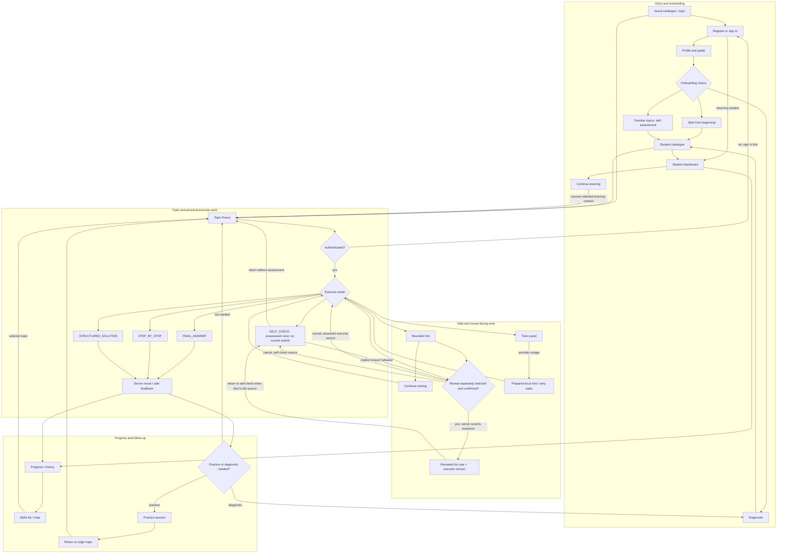

# MS6-I01: Screen map and transitions

## Transition rules

- `Topic -> Exercise` keeps the topic reference and exposes only the public exercise contract.
- `Topic -> personal Exercise` crosses an explicit auth gate. Guests keep catalogue/theory access but cannot start personal attempt flows.
- `Exercise -> Result` is server-authoritative; processing/retry never makes a second progress claim. A correction after completed evaluation starts a new attempt.
- `SELF_CHECK` is a separate unassessed view with no scored submit or assessment-result transition. Explicit reveal (when allowed) and return are available; neither viewing nor revealing it increases mastery. Cancelling reveal returns to the originating view.
- The authenticated dashboard provides a continue-learning entry and access to progress/history and the skills list/map. These are conceptual surfaces, not route or API names.
- `Hint -> Continue` is the ordinary path. Reveal remains a separately selected and confirmed action; exposure persists for the user + exercise version across attempts.
- `Result -> Practice` states a target/reason and preserves an origin-topic reference; student may leave at any time.
- `Result -> Topic` remains available when no practice or diagnostic is needed.
- `Tutor/help` is available while the learner works, and `Tutor outage -> Prepared hint` keeps deterministic validation available while clearly labelling the unavailable service.
- A guest may traverse catalogue/theory but cannot open personal progress, history, diagnostic, or persistent attempt flows.

## Existing versus future surfaces

Existing Content catalogue/topic routes remain the host for theory. The account, exercise, progress, diagnostic/practice and Tutor screens are future surfaces described here for I02--I14; their route names and API endpoints are intentionally not invented by I01.
